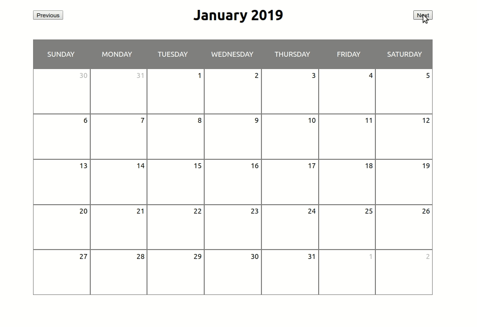

# :calendar: Simple Calendar
This is a simple calendar built with React and bootstraped with create-react-app.

## :bookmark: Features
- Create an event
- Create an event with multiple days
- Save data on local storage
- Edit event
- Delete event

## :running: Running
After clone this project, make sure you are in the project folder and then run `npm install` to install all the project dependencies and then run `npm start`. The project will start at [http://localhost:3000](http://localhost:3000).

## :exclamation: TODO
- [ ] :pencil: Fetch events from api
- [ ] :page_with_curl: Tests
- [ ] :nail_care: Make things look pretty and responsive
